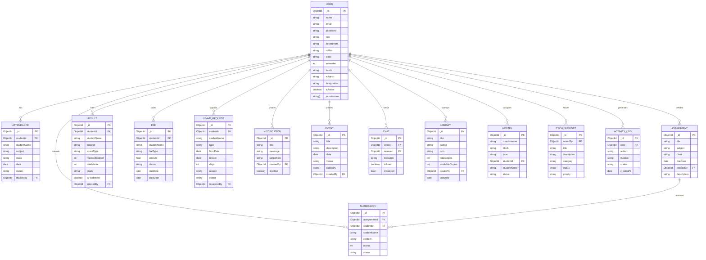
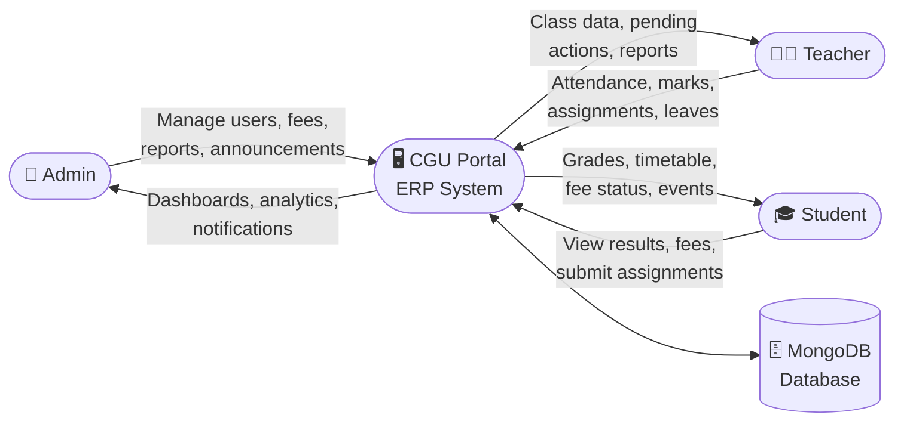

# Software Requirements Specification (SRS)
## CGU Portal — College ERP System

**Version:** 1.0  
**Date:** 2024  
**Prepared By:** CGU Portal Team  

---

## 1. Introduction

### 1.1 Purpose
This document describes the software requirements for the CGU Portal, a web-based College ERP (Enterprise Resource Planning) system built using the MERN stack (MongoDB, Express.js, React, Node.js).

### 1.2 Scope
CGU Portal is a centralized academic management system for educational institutions. It manages students, faculty, attendance, results, fees, hostel, library, events, and more through a role-based web application.

### 1.3 Definitions
| Term | Description |
|------|-------------|
| ERP | Enterprise Resource Planning |
| MERN | MongoDB, Express, React, Node.js |
| JWT | JSON Web Token (used for authentication) |
| RBAC | Role-Based Access Control |
| API | Application Programming Interface |
| SRS | Software Requirements Specification |

### 1.4 Technology Stack
| Layer | Technology |
|-------|-----------|
| Frontend | React 18, Tailwind-like CSS, Recharts, Framer Motion |
| Backend | Node.js, Express.js 5 |
| Database | MongoDB with Mongoose ODM |
| Authentication | JWT (JSON Web Tokens) |
| Password Hashing | bcryptjs |
| HTTP Client | Axios |

---

## 2. Overall Description

### 2.1 System Overview
CGU Portal is a full-stack web application with:
- A **React** frontend running on port 3000
- A **Node.js/Express** backend API running on port 5000
- A **MongoDB** database running locally on port 27017

### 2.2 User Roles
The system supports three roles:

| Role | Description |
|------|-------------|
| **Admin** | Full system access — manages users, fees, notices, reports |
| **Teacher** | Manages attendance, assignments, results, leave approvals |
| **Student** | Views own data — attendance, results, fees, assignments |

### 2.3 Default Login Credentials
| Role | Email | Password |
|------|-------|----------|
| Admin | admin@college.edu | admin123 |
| Teacher | teacher@college.edu | teacher123 |
| Student | student@college.edu | student123 |

---

## 3. Functional Requirements

### 3.1 Authentication Module
| ID | Requirement |
|----|-------------|
| FR-01 | User shall be able to login with email and password |
| FR-02 | System shall issue a JWT token on successful login |
| FR-03 | System shall reject inactive accounts |
| FR-04 | User shall be able to change password after login |
| FR-05 | User shall be able to update their profile |
| FR-06 | System shall log all login attempts (success/failure) |

### 3.2 User Management (Admin)
| ID | Requirement |
|----|-------------|
| FR-07 | Admin shall be able to create new users (student/teacher/admin) |
| FR-08 | Admin shall be able to view all users with filters by role |
| FR-09 | Admin shall be able to activate/deactivate user accounts |
| FR-10 | Admin shall be able to edit user details |
| FR-11 | System shall auto-assign permissions based on role |
| FR-12 | Admin shall be able to view activity logs |

### 3.3 Attendance Management
| ID | Requirement |
|----|-------------|
| FR-13 | Teacher shall be able to mark attendance for students |
| FR-14 | System shall calculate attendance percentage per student |
| FR-15 | Student shall be able to view their own attendance records |
| FR-16 | System shall flag students with attendance below 75% |
| FR-17 | Admin shall be able to view attendance reports |

### 3.4 Assignment Management
| ID | Requirement |
|----|-------------|
| FR-18 | Teacher shall be able to create assignments with due dates |
| FR-19 | Student shall be able to view and submit assignments |
| FR-20 | Teacher shall be able to grade submitted assignments |
| FR-21 | System shall show pending/submitted/graded status |

### 3.5 Results & Examination
| ID | Requirement |
|----|-------------|
| FR-22 | Teacher shall be able to enter marks for students |
| FR-23 | System shall auto-calculate grades (A+, A, B+, B, C+, C, F) |
| FR-24 | System shall calculate SGPA and CGPA |
| FR-25 | Teacher shall be able to publish/unpublish results |
| FR-26 | Student shall view only published results |
| FR-27 | System shall show grade distribution analytics |

### 3.6 Fee Management
| ID | Requirement |
|----|-------------|
| FR-28 | Admin shall be able to create fee records for students |
| FR-29 | System shall track fee status: paid, pending, overdue |
| FR-30 | Student shall be able to view their fee details |
| FR-31 | Admin shall be able to mark fees as paid |
| FR-32 | System shall show fee collection analytics |

### 3.7 Hostel Management
| ID | Requirement |
|----|-------------|
| FR-33 | Admin shall be able to manage hostel room allocations |
| FR-34 | Student shall be able to view their hostel details |
| FR-35 | System shall track room availability |

### 3.8 Library Management
| ID | Requirement |
|----|-------------|
| FR-36 | Admin/Teacher shall be able to add books to the library |
| FR-37 | Student shall be able to search and view available books |
| FR-38 | System shall track issued and returned books |
| FR-39 | System shall show due dates for issued books |

### 3.9 Leave Management
| ID | Requirement |
|----|-------------|
| FR-40 | Student shall be able to apply for leave |
| FR-41 | Teacher shall be able to approve or reject leave requests |
| FR-42 | System shall track leave history per student |
| FR-43 | Admin shall view all leave requests |

### 3.10 Notifications & Announcements
| ID | Requirement |
|----|-------------|
| FR-44 | Admin/Teacher shall be able to post announcements |
| FR-45 | Announcements shall be targeted by role |
| FR-46 | All users shall be able to view announcements |
| FR-47 | System shall show unread notification indicator |

### 3.11 Events Management
| ID | Requirement |
|----|-------------|
| FR-48 | Admin/Teacher shall be able to create campus events |
| FR-49 | All users shall be able to view upcoming events |
| FR-50 | Events shall show date, venue, and description |

### 3.12 Chat / Messaging
| ID | Requirement |
|----|-------------|
| FR-51 | Students and teachers shall be able to send messages |
| FR-52 | System shall show message history |
| FR-53 | Messages shall be stored in the database |

### 3.13 Lost & Found
| ID | Requirement |
|----|-------------|
| FR-54 | Any user shall be able to post lost/found items |
| FR-55 | Users shall be able to view all lost/found listings |
| FR-56 | Owner shall be able to mark item as resolved |

### 3.14 Tech Support
| ID | Requirement |
|----|-------------|
| FR-57 | Any user shall be able to raise a tech support ticket |
| FR-58 | Admin shall be able to view and resolve tickets |
| FR-59 | System shall track ticket status: open, in-progress, resolved |

### 3.15 Dispensary / Medical
| ID | Requirement |
|----|-------------|
| FR-60 | Students shall be able to log medical visits |
| FR-61 | Admin shall be able to manage dispensary records |

### 3.16 Food / Canteen
| ID | Requirement |
|----|-------------|
| FR-62 | Admin shall be able to post daily menu |
| FR-63 | Students shall be able to view the canteen menu |

### 3.17 Timetable
| ID | Requirement |
|----|-------------|
| FR-64 | System shall display weekly class timetable |
| FR-65 | System shall highlight the current ongoing class |
| FR-66 | Timetable shall be viewable by day and weekly overview |

### 3.18 Dashboard
| ID | Requirement |
|----|-------------|
| FR-67 | Admin dashboard shall show system-wide analytics |
| FR-68 | Teacher dashboard shall show class performance charts |
| FR-69 | Student dashboard shall show attendance, fees, assignments summary |
| FR-70 | Dashboard shall have quick action shortcuts |

---

## 4. Non-Functional Requirements

### 4.1 Performance
| ID | Requirement |
|----|-------------|
| NFR-01 | API responses shall be returned within 2 seconds |
| NFR-02 | Frontend shall load within 3 seconds on first load |
| NFR-03 | System shall support at least 100 concurrent users |

### 4.2 Security
| ID | Requirement |
|----|-------------|
| NFR-04 | All passwords shall be hashed using bcrypt (salt rounds: 12) |
| NFR-05 | All API routes (except login/register) shall require JWT |
| NFR-06 | Role-based access control shall be enforced on all routes |
| NFR-07 | JWT tokens shall expire after 7 days |
| NFR-08 | Sensitive data (.env) shall never be committed to version control |

### 4.3 Usability
| ID | Requirement |
|----|-------------|
| NFR-09 | System shall support dark and light themes |
| NFR-10 | UI shall be responsive across desktop and mobile devices |
| NFR-11 | System shall provide clear error messages on failed operations |

### 4.4 Reliability
| ID | Requirement |
|----|-------------|
| NFR-12 | System shall handle MongoDB connection failures gracefully |
| NFR-13 | Frontend shall use Error Boundaries to prevent full page crashes |
| NFR-14 | All API calls shall have error handling with fallback states |

### 4.5 Maintainability
| ID | Requirement |
|----|-------------|
| NFR-15 | Code shall follow MVC architecture on the backend |
| NFR-16 | Frontend shall use reusable component-based architecture |
| NFR-17 | Environment variables shall be used for all configuration |

---

## 5. System Architecture

```
┌─────────────────────────────────────────┐
│              React Frontend              │
│         (localhost:3000)                 │
│  Pages / Components / API Service       │
└──────────────────┬──────────────────────┘
                   │ HTTP (Axios)
                   ▼
┌─────────────────────────────────────────┐
│           Express.js Backend            │
│         (localhost:5000)                │
│  Routes → Controllers → Models         │
│  JWT Auth Middleware / RBAC            │
└──────────────────┬──────────────────────┘
                   │ Mongoose ODM
                   ▼
┌─────────────────────────────────────────┐
│              MongoDB                    │
│         (localhost:27017)               │
│  Database: erp                          │
└─────────────────────────────────────────┘
```

---

## 6. Database Collections

| Collection | Description |
|------------|-------------|
| users | Students, teachers, admins with RBAC |
| activitylogs | Login and action audit trail |
| assignments | Assignment records |
| submissions | Student assignment submissions |
| attendances | Daily attendance records |
| results | Exam marks and grades |
| fees | Fee records per student |
| hostels | Hostel room allocations |
| libraries | Book inventory and issue records |
| leaverequests | Student leave applications |
| notifications | Announcements and notices |
| events | Campus events |
| chats | Messages between users |
| lostfounds | Lost and found items |
| techsupports | IT support tickets |
| dispensaries | Medical visit records |
| foods | Canteen menu items |

---

## 7. API Overview

| Module | Base Route |
|--------|-----------|
| Authentication | /api/auth |
| Users | /api/users |
| Attendance | /api/attendance |
| Assignments | /api/assignments |
| Submissions | /api/submissions |
| Results | /api/results |
| Fees | /api/fees |
| Hostel | /api/hostel |
| Library | /api/library |
| Leaves | /api/leaves |
| Notifications | /api/notifications |
| Events | /api/events |
| Chat | /api/chat |
| Lost & Found | /api/lostfound |
| Tech Support | /api/tech |
| Dispensary | /api/dispensary |
| Food | /api/food |

---

## 8. Constraints

- Requires Node.js >= 18.0.0
- Requires MongoDB >= 6.0 running locally
- Internet connection required for Google Fonts
- `.env` file must be configured before running the backend

---

## 9. Future Enhancements

| Feature | Priority |
|---------|----------|
| Mobile app (React Native) | High |
| Real-time notifications (Socket.io) | High |
| Online fee payment (Razorpay) | Medium |
| AI-powered study planner | Medium |
| Biometric attendance integration | Low |
| Blockchain-based certificates | Low |
| Multi-language support | Low |

---

## 10. Use Case Diagram

```mermaid
flowchart TD
    Admin([👤 Admin])
    Teacher([👨‍🏫 Teacher])
    Student([🎓 Student])

    subgraph AUTH [Authentication]
        UC1[Login]
        UC2[Logout]
        UC3[Change Password]
        UC4[Update Profile]
    end

    subgraph ADMIN_UC [Admin Use Cases]
        UC5[Manage Users]
        UC6[View Activity Logs]
        UC7[Manage Fees]
        UC8[Post Announcements]
        UC9[Manage Hostel]
        UC10[View Reports & Analytics]
        UC11[Resolve Tech Tickets]
        UC12[Manage Events]
        UC13[Manage Canteen Menu]
    end

    subgraph TEACHER_UC [Teacher Use Cases]
        UC14[Mark Attendance]
        UC15[Create Assignments]
        UC16[Grade Submissions]
        UC17[Enter Exam Marks]
        UC18[Publish Results]
        UC19[Approve/Reject Leaves]
        UC20[Send Messages]
        UC21[Post Announcements]
    end

    subgraph STUDENT_UC [Student Use Cases]
        UC22[View Attendance]
        UC23[Submit Assignments]
        UC24[View Results & GPA]
        UC25[View Fee Details]
        UC26[Apply for Leave]
        UC27[Search Library Books]
        UC28[View Timetable]
        UC29[Post Lost & Found]
        UC30[Raise Tech Ticket]
        UC31[Send Messages]
        UC32[View Events]
        UC33[View Canteen Menu]
        UC34[View Hostel Details]
        UC35[Log Medical Visit]
    end

    Admin --> UC1 & UC2 & UC3 & UC4
    Teacher --> UC1 & UC2 & UC3 & UC4
    Student --> UC1 & UC2 & UC3 & UC4

    Admin --> UC5 & UC6 & UC7 & UC8 & UC9 & UC10 & UC11 & UC12 & UC13
    Teacher --> UC14 & UC15 & UC16 & UC17 & UC18 & UC19 & UC20 & UC21
    Student --> UC22 & UC23 & UC24 & UC25 & UC26 & UC27 & UC28 & UC29 & UC30 & UC31 & UC32 & UC33 & UC34 & UC35
```



---

## 11. ER Diagram (Entity Relationship)



---

## 12. Data Flow Diagram (DFD)

### Level 0 — Context Diagram



---

### Level 1 — Detailed DFD

```mermaid
flowchart TD
    Admin([👤 Admin])
    Teacher([👨‍🏫 Teacher])
    Student([🎓 Student])

    subgraph P1 ["1.0 Authentication"]
        Login["1.1 Validate Login"]
        Token["1.2 Issue JWT Token"]
        RBAC["1.3 Check Role & Permissions"]
    end

    subgraph P2 ["2.0 User Management"]
        CreateUser["2.1 Create User"]
        ManageUser["2.2 Edit / Deactivate"]
        ViewLogs["2.3 View Activity Logs"]
    end

    subgraph P3 ["3.0 Academic Management"]
        Attendance["3.1 Mark Attendance"]
        Assignment["3.2 Create Assignment"]
        Submission["3.3 Submit Assignment"]
        Results["3.4 Enter & Publish Marks"]
        Timetable["3.5 View Timetable"]
    end

    subgraph P4 ["4.0 Finance Management"]
        FeeCreate["4.1 Create Fee Record"]
        FeeView["4.2 View Fee Status"]
        FeePay["4.3 Mark as Paid"]
    end

    subgraph P5 ["5.0 Campus Services"]
        Hostel["5.1 Hostel Allocation"]
        Library["5.2 Library Management"]
        Food["5.3 Canteen Menu"]
        Dispensary["5.4 Medical Records"]
        Events["5.5 Events Management"]
    end

    subgraph P6 ["6.0 Communication"]
        Notice["6.1 Post Announcement"]
        Chat["6.2 Send Message"]
        Leave["6.3 Leave Request"]
        LostFound["6.4 Lost & Found"]
        Tech["6.5 Tech Support"]
    end

    DB[("🗄️ MongoDB")]

    Admin --> Login --> Token --> RBAC
    Teacher --> Login
    Student --> Login

    Admin --> CreateUser & ManageUser & ViewLogs
    Admin --> FeeCreate & FeePay
    Admin --> Hostel & Events & Food

    Teacher --> Attendance & Assignment & Results
    Teacher --> Notice & Leave

    Student --> Submission & Timetable
    Student --> FeeView
    Student --> Library & Dispensary
    Student --> Chat & LostFound & Tech

    P1 & P2 & P3 & P4 & P5 & P6 <--> DB
```



---

*End of SRS Document*
